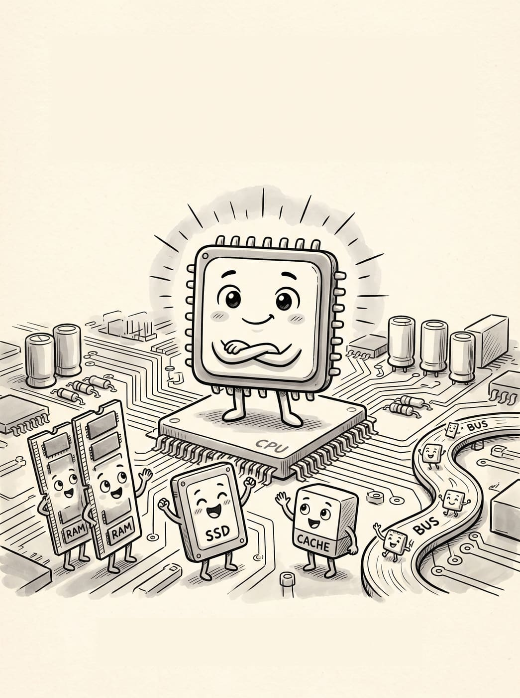
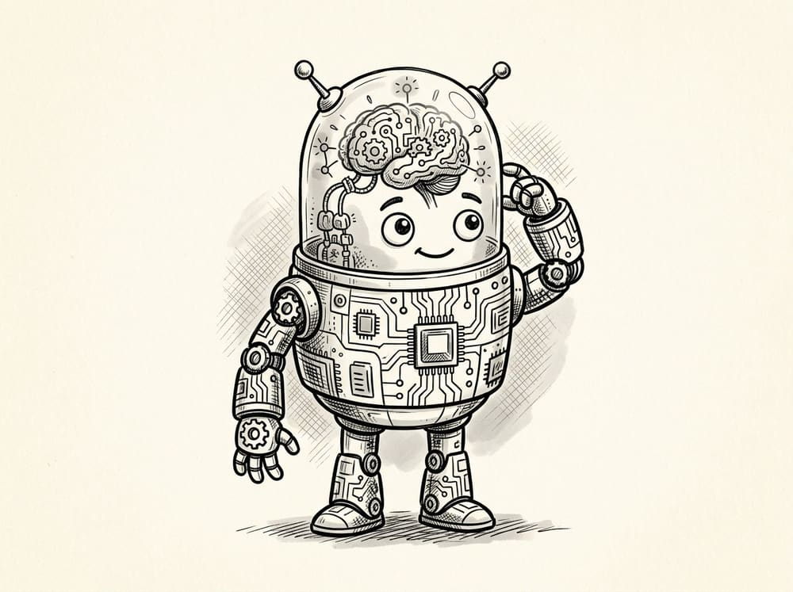

지난 30년 동안 저는 컴퓨터 곁을 떠난 적이 없습니다. 전산팀 팀장으로 크고 작은 시스템을 책임졌고, A/S 현장에서 고장 난 컴퓨터를 셀 수 없이 뜯고 고쳤습니다. 서버 유지보수를 하며 눈에 안 보이는 곳에서 컴퓨터가 어떻게 돌아가는지 지켜봤고, 10년은 개발자로 소프트웨어와 하드웨어 사이를 오갔습니다. 네트워크 현장까지 거치고 나니, 어느새 컴퓨터의 처음부터 끝까지 두루 겪어본 사람이 되어 있더군요.

그 시간 내내 머릿속을 떠나지 않던 질문이 하나 있습니다.

**"이 어렵고 복잡한 걸, 어떻게 하면 쉽고 재미있게 설명할 수 있을까?"**

그래서 책을 썼습니다. 30년간 현장에서 몸으로 배운 것들을, 어려운 용어 대신 친구가 옆에서 이야기해주듯 풀어내고 싶었습니다.

*책에 나오는 컴퓨터 속 친구들. CPU를 중심으로 RAM, SSD, 캐시, 버스가 함께 등장합니다.*

그렇게 나온 첫 번째 이야기가 **《컴퓨터로 여는세상》 1편 — CPU**입니다.

> CPU만 이해하면, 컴퓨터가 보인다.

## 책 속 한 장면, 살짝 보여드릴게요

전문 용어로 시작하지 않습니다. 딱 이렇게 시작해요.

> 우리가 컴퓨터를 켜면 화면을 보고, 마우스를 움직이고, 키보드를 눌러. 근데 컴퓨터 안에서는? 보이지 않는 곳에서 수많은 일이 벌어지고 있어. 우리가 클릭한 아주 작은 행동 하나도, 컴퓨터 안에서는 여러 단계로 나뉘어서 처리되지.
>
> 그 중심에 있는 아주 특별한 아이가 있어. 바로 **CPU**야.

CPU라는 이름부터 설명합니다.

> CPU? 이 이름부터 좀 어렵게 들릴 수 있지. 영어로는 **Central Processing Unit**이고, 우리말로는 **중앙 처리 장치**라고 해. 다만 이름은 어려워 보이지만, 하는 일은 생각보다 단순해.
>
> **CPU의 가장 중요한 역할은 뭐냐면:** 계산하고, 명령을 처리하고, 결과를 만들어내는 거야. 한마디로: **CPU는 컴퓨터에서 가장 빠르게 생각하고 계산하는 아이야.**

*책 속 CPU 캐릭터. 이 친구를 따라가며 컴퓨터 안을 하나씩 들여다봅니다.*

이런 식으로, 코어와 스레드, 클럭 속도, 인텔과 AMD의 차이, 요즘 CPU에 들어간다는 AI 기능까지 — 컴퓨터 전문가가 아니어도 끝까지 편하게 읽을 수 있도록 처음부터 하나씩 풀어썼습니다. 삽화도 전부 새로 만들어서, 글만 읽는 것보다 훨씬 재미있게 볼 수 있을 거예요.

이 책은 컴퓨터 전문가를 위한 책이 아닙니다. 컴퓨터를 매일 쓰지만 그 안이 궁금했던 분들을 위한 책입니다.

**컴퓨터 이야기는 여기서 끝이 아닙니다.** 다음 편에서는 RAM 이야기로 찾아뵐게요.

구매처는 정해지는 대로 이곳에 안내해드리겠습니다.
